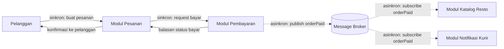

# Tugas 2 (Pekan 2) — Perancangan Arsitektur untuk FoodGo

**Materi terkait:** Architectural style (Layered, SOA, Peer-to-Peer, Publish-Subscribe).

**Kelompok:** [Kelompok 5]

| Nama | NIM |
|---|---|
| [Bethari Nevyta Amaries] | [103072430016] |
| [A'ilah Nailul Fa'izah] | [103072400042] | 

## Gaya Arsitektur yang Dipilih
Berdasarkan hasil diskusi kelompok, kami memutuskan untuk menggunakan kombinasi dari Service Oriented Architecture (SOA) dan Publish Subscribe (Pub Sub) pada skenario FoodGo. Yang dimana pada modul pembayaran dan pesanan menggunakan SOA karena membutuhkan komunikasi langsung dan sinkron yang memberikan notifikasi secara real time kepada pelanggan apakah pembayaran yang dilakukan berhasil atau gagal. Jika kedua modul ini menggunakan Pub Sub, maka pelanggan tidak akan mendapatkan notifikasi secara real time karena modul pembayaran akan mengirimkan event ke message broker tanpa perlu mengetahui siapa yang menerimanya.

Kemudian pada modul notifikasi dan katalog resto menggunakan Pub Sub karena tidak membutuhkan komunikasi langsung yang cepat, hanya membutuhkan komunikasi bahwa ada event yang terjadi pada modul pesanan dan pembayaran. Selain itu Pub Sub juga hanya perlu mengirimkan event ke message broker tanpa perlu memanggil modul notifikasi dan katalog satu per satu. Sehingga Pub Sub lebih efisien untuk digunakan pada modul notifikasi dan katalog resto. 

## Diagram Arsitektur

## Analisis Alur Skenario End-to-End 
Pelanggan mengirim pesanan ke Modul Pesanan, setelah itu Modul Pesanan akan langsung memanggil Modul Pembayaran dan menunggu balasannya. Menurut kami fase ini harus sinkron karena pesanan baru boleh dianggap valid setelah pembayaran benar-benar berhasil. Jika dibuat asinkron, ada resiko pelanggan melihat status pesanan diterima padahal pembayaran gagal terproses. Setelah proses pembayaran selesai, Modul Pembayaran mengirimkan balasan status (berhasil/gagal) kembali ke Modul Pesanan.

Setelah pembayaran berhasil, Modul Pembayaran tidak memanggil Modul Katalog Resto dan Modul Notifikasi secara langsung, tetapi memberikan notifikasi satu event OrderPaid ke broker. Broker kemudian meneruskan event OrderPaid yang sama ke dua subscriber yaitu Modul Katalog Resto dan Modul Notifikasi, keduanya kemudian melakukan proses sendiri tanpa ditunggu oleh Modul Pesanan. Modul Pesanan kemudian mengirimkan konfirmasi ke pelanggan begitu pembayaran telah berhasil, tanpa harus menunggu resto merespon atau kurir ditemukan terlebih dahulu.

## Analisis Trade-off
Berdasarkan hasil analisis kami, penggunaan arsitektur Pub Sub pada modul notifikasi kurir dan katalog resto dapat mengurangi masalah coupling yang terjadi pada Tugas 1. Yang dimana, apabila katalog down maka modul lainnya tetap berjalan dan tidak saling menunggu. Hal tersebut juga berlaku pada modul notifikasi kurir, apabila kurir melakukan update pada kode kurir modul lainnya tidak akan ikut terpengaruh. 

Namun terdapat beberapa kekurangan pada arsitektur yang kami pilih. Pada modul pembayaran hanya melakukan publish event ke broker tanpa menunggu balasan dari subscriber, sehingga apabila terjadi error pada modul katalog resto ataupun modul notifikasi kurir, modul pembayaran tidak akan mengetahuinya. Kemudian apabila terjadi error pada Pub Sub membuat lebih sulit untuk dilacak karena alurnya tidak linear. Dan yang terakhir, apabila ada masalah pada modul pesanan, modul pembayaran akan ikut down karena masih membutuhkan komunikasi yang sinkron dan begitu pula sebaliknya. Namun hal tersebut tidak berpengaruh ke modul notifikasi kurir dan katalog resto karena keduanya sudah terpisah melalui Pub Sub. 
