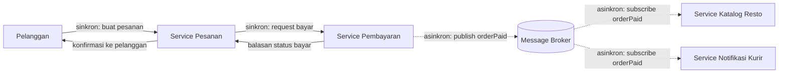
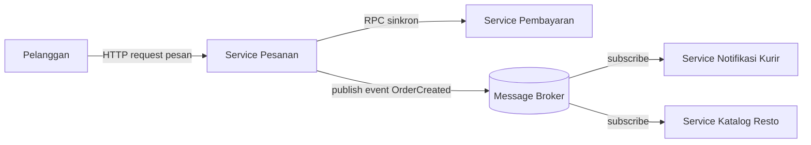

# Tugas 2 (Pekan 2) — Perancangan Arsitektur untuk FoodGo

**Materi terkait:** Architectural style (Layered, SOA, Peer-to-Peer, Publish-Subscribe).

**Kelompok:** [Kelompok 5]

| Nama | NIM | Kontribusi |
|---|---|---|
| [Bethari Nevyta Amaries] | [103072430016] | [Pitfall 1 (Bandwidth is Infinite) & Pitfall 3 (Design Failure: Arsitektur Monolitik)] |
| [A'ilah Nailul Fa'izah] | [103072400042] | [Pitfall 2 (The Network is Reliable) & Kesimpulan] |

## Gaya Arsitektur yang Dipilih
Berdasarkan hasil diskusi kelompok, kami memutuskan untuk menggunakan kombinasi dari Service Oriented Architecture (SOA) dan Publish Subscribe (Pub Sub) pada skenario FoodGo. Yang dimana pada modul pembayaran dan pesanan menggunakan SOA karena membutuhkan komunikasi langsung dan sinkron yang memberikan notifikasi secara real time kepada pelanggan apakah pembayaran yang dilakukan berhasil atau gagal. Jika kedua modul ini menggunakan Pub Sub, maka pelanggan tidak akan mendapatkan notifikasi secara real time karena modul pembayaran akan mengirimkan event ke message broker tanpa perlu mengetahui siapa yang menerimanya.

Kemudian pada modul notifikasi dan katalog resto menggunakan Pub Sub karena tidak membutuhkan komunikasi langsung yang cepat, hanya membutuhkan komunikasi bahwa ada event yang terjadi pada modul pesanan dan pembayaran. Selain itu Pub Sub juga hanya perlu mengirimkan event ke message broker tanpa perlu memanggil modul notifikasi dan katalog satu per satu. Sehingga Pub Sub lebih efisien untuk digunakan pada modul notifikasi dan katalog resto. 

## Diagram Arsitektur


## Analisis Alur Skenario End to End 
Pelanggan mengirim pesanan ke Service pesanan, setelah itu service pesanan akan langsung memanggil service pembayaran dan menunggu balasannya (request-response). Menurut kami fase ini harus sinkron karena pesanan baru boleh dianggap valid setelah pembayaran benar-benar berhasil. Jika dibuat asinkron, ada resiko pelanggan melihat status pesanan diterima padahal pembayaran gagal terproses.

Setelah pembayaran berhasil, service pembayaran tidak memanggil service katalog resto dan service notifikasi secara langsung, tetapi memberikan notifikasi satu event OrderPaid ke broker. Broker kemudian meneruskan event OrderPaid yang sama ke dua subscriber yaitu service katalog resto dan service notifikasi, keduanya kemudian melakukan proses sendiri tanpa ditunggu oleh service pesanan. Pelanggan kemudian mendapatkan notifikasi begitu pembayaran telah berhasil tanpa harus menungggu resto merespon atau kurir ditemukan terlebih dahulu.

## Studi Kasus

Melanjutkan Tugas 1: FoodGo butuh sistem yang **decoupled** agar tim kurir dan tim resto tidak saling mengganggu ketika salah satu modul diperbarui/deploy ulang. Saat ini semua modul (pesanan, pembayaran, notifikasi kurir, katalog resto) berjalan sebagai satu aplikasi monolitik — sekali deploy, semua modul ikut restart dan berisiko downtime total.

## Tugas Kelompok

1. Pilih **satu** gaya arsitektur utama: **Service-Oriented Architecture (SOA)** atau **Publish-Subscribe**. Boleh dikombinasikan (mis. SOA untuk service inti + Pub-Sub untuk notifikasi), tapi harus dijustifikasi kenapa kombinasi ini yang dipilih.
2. Gambarkan minimal 4 komponen berikut dan interaksinya: modul Pesanan, modul Pembayaran, modul Kurir/Notifikasi, modul Katalog Resto (dan message broker/API gateway jika relevan).
3. Jelaskan alur satu skenario penuh secara end-to-end di diagram (misalnya: pelanggan buat pesanan → bayar → resto terima notifikasi → kurir ditugaskan) — tunjukkan komponen mana berkomunikasi dengan siapa, dan **jenis komunikasinya** (sinkron/asinkron, request-response/event).
4. Analisis tertulis: kenapa gaya ini mengatasi masalah *coupling* dari Tugas 1, dan apa trade-off-nya (mis. Pub-Sub menambah kompleksitas debugging karena alur tidak linear).

## Cara Membuat Diagram (Gratis, Cukup Laptop)

Tidak perlu software berbayar. Dua opsi:

**Opsi A — Mermaid di dalam Markdown (disarankan).** Ditulis sebagai teks biasa di `README.md`, otomatis dirender jadi diagram oleh GitHub — tidak perlu install apa pun.

````markdown

````

**Opsi B — draw.io / diagrams.net** (gratis, jalan di browser tanpa akun, atau app desktop offline di [app.diagrams.net](https://app.diagrams.net/)). Ekspor sebagai `.png` dan simpan di folder `diagram/`.

## Struktur Submission

```
tugas-02-perancangan-arsitektur/
├── README.md          # Analisis + diagram Mermaid (jika Opsi A) atau referensi ke diagram/
├── JURNAL.md
└── diagram/            # File .png/.drawio jika pakai Opsi B
```

## Rubrik Penilaian (Tugas 2)

| Komponen | Bobot | Kriteria |
|---|---|---|
| Ketepatan pemilihan gaya arsitektur | 20% | Justifikasi SOA/Pub-Sub sesuai kebutuhan *decoupling* di skenario |
| Kelengkapan & kejelasan diagram | 30% | Semua komponen kunci ada, jenis komunikasi (sinkron/asinkron) jelas ditandai |
| Analisis trade-off | 30% | Bukan hanya kelebihan — kekurangan/kompleksitas baru juga dibahas |
| Proses & kontribusi kelompok | 20% | `JURNAL.md`, commit history |

## Batasan Penggunaan AI (Level 2)

Kebijakan **Level 2 (AI Assisted Idea Generation & Structuring)** berlaku — lihat [`../RUBRIK-UMUM.md`](../RUBRIK-UMUM.md). Boleh memakai AI untuk brainstorming komponen apa saja yang umum ada di gaya arsitektur SOA/Pub-Sub; **tidak boleh** meminta AI menggambar diagram final atau menuliskan analisis trade-off yang tinggal ditempel. Catat pemakaian AI di "Log Penggunaan AI" pada `JURNAL.md`.

- Diagram Mermaid/draw.io yang "terlalu generik" (identik dengan contoh tutorial di internet tanpa penyesuaian ke kasus FoodGo) akan dinilai rendah pada komponen kelengkapan & kejelasan diagram.
